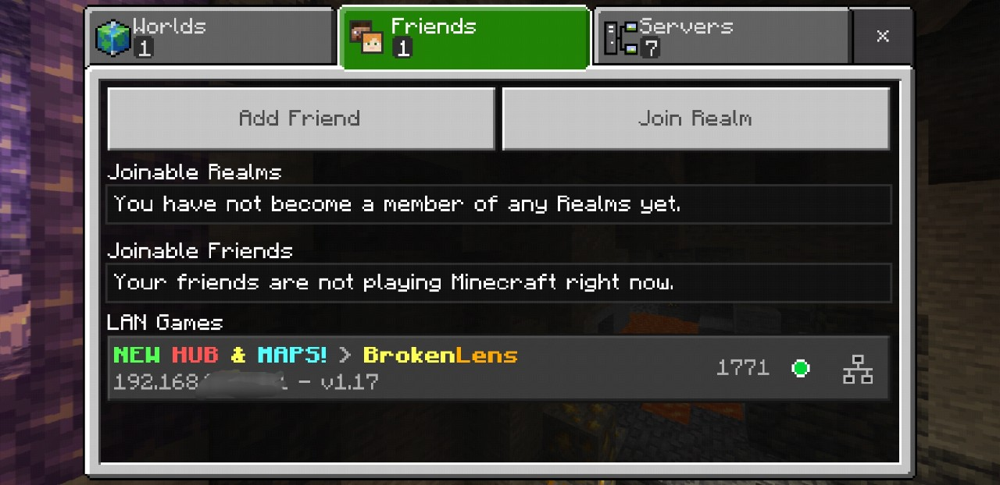
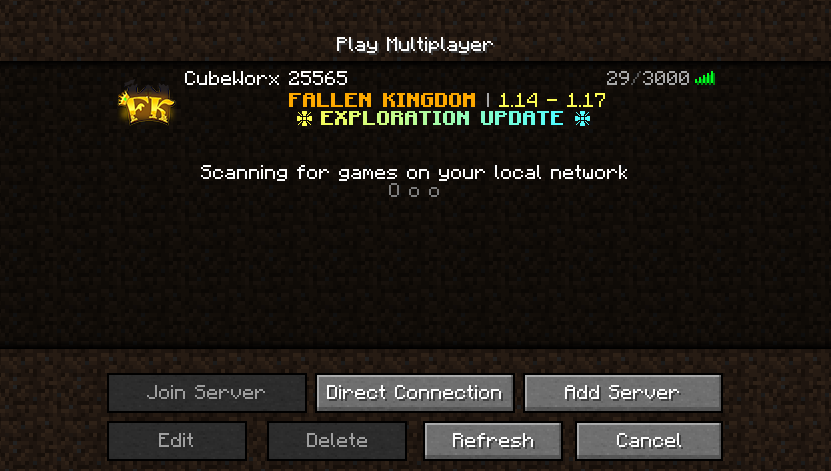

[](https://github.com/cubeworx/cbwxproxy/actions)
[](https://hub.docker.com/r/cubeworx/cbwxproxy)
[](https://hub.docker.com/r/cubeworx/cbwxproxy)
[](https://hub.docker.com/r/cubeworx/cbwxproxy)
[](https://github.com/cubeworx/cbwxproxy/blob/master/LICENSE)
[](https://twitter.com/intent/follow?screen_name=cubeworx)

CubeWorx Minecraft Server Proxy Image
==============

This image is a self-contained Minecraft server proxy utilizing [Traefik](https://traefik.io). It is intended for use in the upcoming CubeWork ecosystem but is also being provided for use in the Minecraft community.

## Quickstart

```
docker run -d -it -p 19132:19132/udp -e CBWXPROXY_BEDROCK_ENABLE=true -e CBWXPROXY_BEDROCK_REMOTE_HOST=fqdn_or_ip:port cubeworx/cbwxproxy
```
or
```
docker run -d -it -p 25565:25565 -e CBWXPROXY_JAVA_ENABLE=true -e CBWXPROXY_JAVA_REMOTE_HOST=fqdn_or_ip:port cubeworx/cbwxproxy
```

## Usage

This image can be used to proxy a remote Bedrock Edition and/or Java Edition server on your local network. For Bedrock Edition this enables the remote server to appear under LAN Games when ran using the default port.

A single container can be used to proxy a connection to different remote Bedrock & Java Edition servers at the same time but only one container per default exposed port.

## Configuration

|                                    |                                                                          |
|------------------------------------|--------------------------------------------------------------------------|
| `CBWXPROXY_BEDROCK_ENABLE="false"` | Enables Bedrock Edition Proxy listener                                   |
| `CBWXPROXY_BEDROCK_PORT="19132"`   | Default IPv4 UDP port the Bedrock Edition Server proxy should listen on. |
| `CBWXPROXY_BEDROCK_REMOTE_HOST=""` | Remote Bedrock FQDN or IP and port to connect to (fqdn_or_ip:port)       |
| `CBWXPROXY_JAVA_ENABLE="false"`    | Enables Java Edition Proxy listener                                      |
| `CBWXPROXY_JAVA_PORT="25565"`      | Default IPv4 TCP port the Java Edition Server proxy should listen on.    |
| `CBWXPROXY_JAVA_REMOTE_HOST=""`    | Remote Java FQDN or IP and port to connect to (fqdn_or_ip:port)          |
| `TRAEFIK_ADMIN_DEBUG="false"`      | Enables additional Traefik admin API endpoints for debugging             |
| `TRAEFIK_ADMIN_ENABLE="false"`     | Enables Traefik admin API and dashboard                                  |
| `TRAEFIK_ADMIN_PORT="8888"`        | Default IPv4 TCP port the Traefik admin should listen on.                |
| `TRAEFIK_LOG_LEVEL="ERROR"`        | Default log level for Traefik                                            |

## Docker Compose
```
version: '3.8'
services:
  cbwxproxy:
    image: cubeworx/cbwxproxy:latest
    network_mode: bridge
    environment:
      CBWXPROXY_BEDROCK_ENABLE: 'true'
      CBWXPROXY_BEDROCK_REMOTE_HOST: fqdn_or_ip:port
      CBWXPROXY_JAVA_ENABLE: 'true'
      CBWXPROXY_JAVA_REMOTE_HOST: fqdn_or_ip:port
    ports:
      - 19132:19132/udp
      - 25565:25565
```

## Connecting

When running the container with port 19132/udp exposed for Bedrock clients, the proxied server will show up under LAN games in the Friends tab:


When running the container with port 25565 exposed for Java clients, you must still add a direct server connection under Multiplayer to connect to the local IP address of the server where the container is running:


## Warnings

This image has been tested and confirmed working with several of the popular community Bedrock Edition servers but found to work with only a couple of the community Java Edition servers.

At present this image is not compatible with [manymine](https://github.com/illiteratealliterator/manymine) or [cbwxannounce](https://github.com/cubeworx/cbwxannounce) but we hope to update them to be compatible soon.